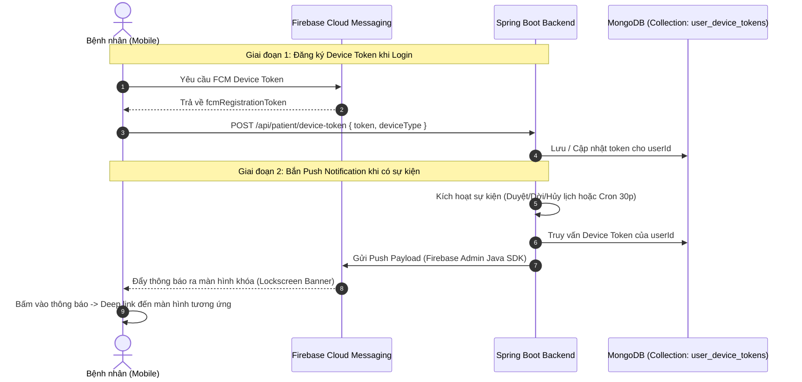

# Firebase Cloud Messaging (FCM) Push Notification Architecture

Tài liệu này đặc tả kiến trúc kỹ thuật tích hợp **Push Notification (FCM)** giữa Backend Java Spring Boot và Client Flutter Mobile cho hệ sinh thái Med SuperApp.

---

## 1. Kiến trúc Tổng thể (High-level Architecture)



---

## 2. Đặc tả API Quản lý Device Token

### 2.1. Đăng ký / Cập nhật Device Token
* **Endpoint:** `POST /api/patient/device-token`
* **Quyền hạn:** `ROLE_PATIENT` (Yêu cầu JWT Bearer Token)
* **Request Body:**
```json
{
  "fcmToken": "eK9zX...",
  "deviceType": "ANDROID", // hoặc "IOS"
  "deviceName": "Samsung Galaxy S24" // tùy chọn
}
```
* **Response:**
```json
{
  "success": true,
  "message": "Device token registered successfully.",
  "data": null,
  "errorCode": null
}
```

### 2.2. Hủy Device Token khi Logout
* **Endpoint:** `DELETE /api/patient/device-token`
* **Quyền hạn:** `ROLE_PATIENT`
* **Request Body:**
```json
{
  "fcmToken": "eK9zX..."
}
```

---

## 3. Thiết kế CSDL (MongoDB Collection: `user_device_tokens`)

```json
{
  "_id": "ObjectId",
  "userId": "String (Indexed)",
  "fcmToken": "String (Unique Indexed)",
  "deviceType": "ANDROID | IOS",
  "deviceName": "String",
  "updatedAt": "ISODate"
}
```

---

## 4. Hướng dẫn Tích hợp Phía Backend Spring Boot

### 4.1. Dependency (`build.gradle`)
```groovy
implementation 'com.google.firebase:firebase-admin:9.3.0'
```

### 4.2. Khởi tạo FirebaseApp Bean
```java
@Configuration
public class FirebaseConfig {
    @Value("${app.firebase.credentials-path:firebase-service-account.json}")
    private String credentialsPath;

    @PostConstruct
    public void initialize() throws IOException {
        if (FirebaseApp.getApps().isEmpty()) {
            GoogleCredentials credentials = GoogleCredentials.fromStream(
                new ClassPathResource(credentialsPath).getInputStream());
            FirebaseOptions options = FirebaseOptions.builder()
                .setCredentials(credentials)
                .build();
            FirebaseApp.initializeApp(options);
        }
    }
}
```

### 4.3. Service Gửi Push Notification (`PushNotificationService.java`)
```java
@Service
@RequiredArgsConstructor
public class PushNotificationService {
    private final UserDeviceTokenRepository tokenRepository;

    public void sendToUser(String userId, String title, String body, Map<String, String> data) {
        List<UserDeviceToken> tokens = tokenRepository.findAllByUserId(userId);
        for (UserDeviceToken token : tokens) {
            Message message = Message.builder()
                .setToken(token.getFcmToken())
                .setNotification(Notification.builder()
                    .setTitle(title)
                    .setBody(body)
                    .build())
                .putAllData(data)
                .build();
            try {
                FirebaseMessaging.getInstance().send(message);
            } catch (FirebaseMessagingException e) {
                // Xử lý hoặc xóa token nếu token hết hạn (UNREGISTERED)
            }
        }
    }
}
```

---

## 5. Hướng dẫn Tích hợp Phía Flutter Mobile

### 5.1. Thư viện (`pubspec.yaml`)
```yaml
dependencies:
  firebase_core: ^3.6.0
  firebase_messaging: ^15.1.3
```

### 5.2. Luồng xử lý sự kiện thông báo (Message Handling)
1. **Foreground (App đang mở):**
   - Nhận sự kiện qua `FirebaseMessaging.onMessage.listen(...)`.
   - Hiển thị In-app Toast / Local Banner thông báo.
2. **Background / Lockscreen (App đang ẩn / Khóa màn hình):**
   - FCM tự động hiển thị Notification trên khay hệ thống.
   - Khi người dùng nhấn vào thông báo $\rightarrow$ `FirebaseMessaging.onMessageOpenedApp` điều hướng theo `data['targetRoute']`.
3. **Terminated (App đã tắt hoàn toàn):**
   - Khi người dùng bấm vào thông báo mở app $\rightarrow$ `FirebaseMessaging.instance.getInitialMessage()` lấy payload và điều hướng ngay sau khi app khởi động xong.
